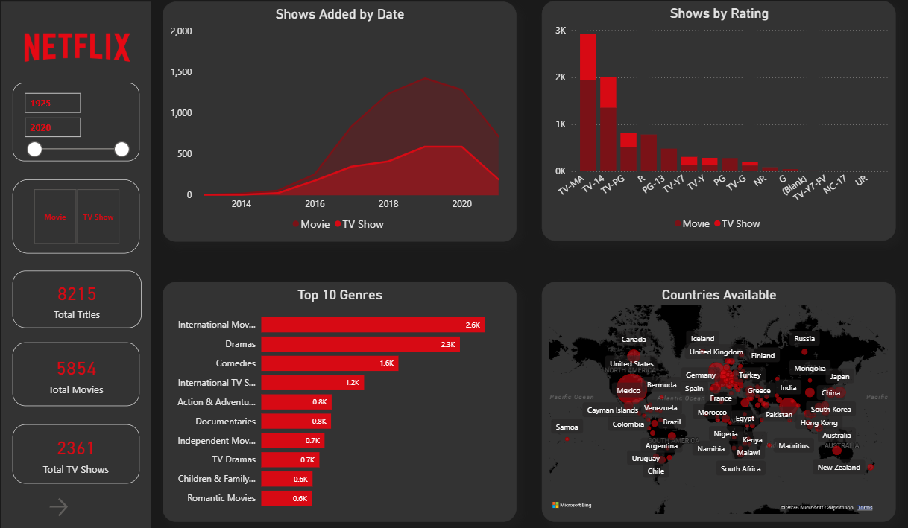
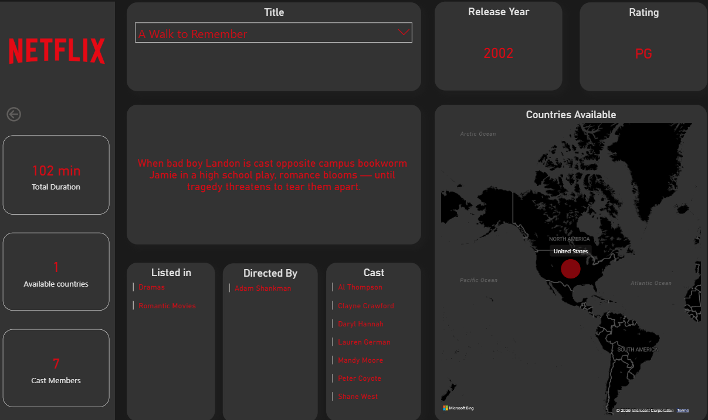
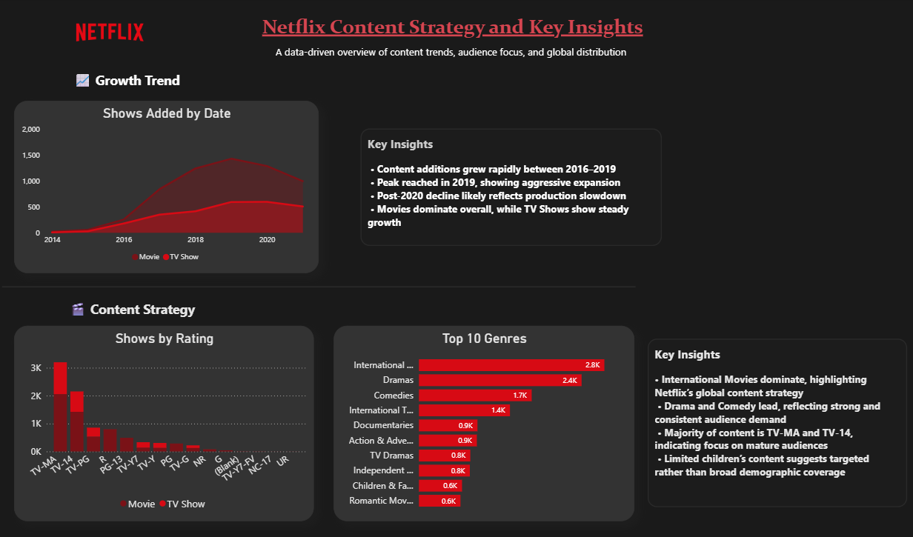

# 🎬 Netflix Content Strategy Dashboard

Analyzed 8,000+ titles from Netflix to uncover content trends, audience preferences, and global distribution strategy.
Built using Power BI, with SQL for data transformation and Excel for preprocessing, delivering actionable insights into genre popularity, maturity ratings, and international expansion.

 

## 📌 Problem Statement

Netflix hosts a vast and diverse content library across multiple genres, countries, and audience segments.
The objective of this project is to analyze content trends and audience preferences to derive insights that support strategic content decisions and global expansion.

 

## 🚀 Key Highlights
- Processed and analyzed 8,000+ Netflix titles to uncover content trends
- Transformed denormalized multi-column data (cast, directors, countries, categories) into structured tables using SQL
- Built an interactive Power BI dashboard with dynamic filters and drilldowns
- Identified key patterns in genre popularity, content growth, and regional distribution
- Designed a scalable data model to support efficient analysis and reporting
- Delivered actionable insights to support content strategy and decision-making

 

## 📊 Dashboard Overview

### Main Dashboard

### 🌍 Global Insights

### 🔍 Title Drilldown Analysis

### 💡 Insights & Strategy

 

## ⚙️ Workflow
- Collected and explored Netflix dataset (CSV format)
- Cleaned and structured data using Excel
- Transformed denormalized data using SQL (UNION operations)
- Built data model and relationships in Power BI
- Designed interactive dashboards and generated insights

 

## 📈 Key Metrics

* Total Titles
* Total Movies vs TV Shows
* Genre Distribution
* Ratings Distribution
* Yearly Content Additions
* Top 10 genres
* Country-wise Availability

 

## 🔑 Key Insights

* 📈 Content additions grew rapidly between **2016–2019**, peaking in 2019, indicating rapid platform expansion
* 🎬 Movies dominate the catalog, while TV Shows show steady growth
* 🔞 Majority of content is rated **TV-MA** and **TV-14**, highlighting focus on mature audiences
* 🌍 **International Movies** lead across genres, reflecting Netflix’s global content strategy
* 🎭 **Drama and Comedy** are the most prominent genres, indicating strong audience demand
* 🌐 Content is widely distributed across **North America, Europe, and Asia**, with emerging markets gaining traction
* 📉 A slight decline post-2020 suggests production slowdowns or strategic shifts

 

## 📈 Business Impact
- Enables content teams to identify high-performing genres for strategic investment
- Supports regional expansion by highlighting country-wise content trends
- Helps optimize content acquisition decisions using data-driven insights
- Identifies growth opportunities based on historical content release patterns
- Assists in targeting audience preferences to improve engagement and retention

 

## 💡 Recommendations

- Increase investment in **International Movies** to strengthen global reach and audience diversity  
- Prioritize **Drama and Comedy genres**, as they consistently show high engagement and demand  
- Focus on **TV Shows growth strategy**, as they demonstrate steady long-term expansion  
- Maintain consistent content releases to avoid post-2020 decline trends  
- Expand presence in **emerging markets (Asia & Europe)** to capture growing audiences

 

## 🛠️ Tools Used

* Power BI
* SQL
* Excel

 

## 📊 Dataset

* Source: Netflix Titles Dataset
* Records: 8,000+ titles
* Key Fields: Title, Genre, Rating, Release Year, Country, Duration, Director, Cast, Listed In, Description ✅
* Format: CSV files
* Preprocessing done using Excel and SQL

 

## 📁 Repository Contents

- 📊 **Power BI Dashboard (.pbix)** – Interactive dashboard with all visualizations  
- 📂 **Dataset Files (.csv)** – Cleaned and processed datasets used for analysis  
- 🧮 **SQL Queries** – Scripts used for data transformation and normalization  
- 🖼️ **Dashboard Images** – Exported visuals for quick preview  
- 📄 **README.md** – Complete project documentation
 

## ▶️ How to Use

1. Clone or download this repository to your local system  
2. Open the Power BI file from the `/Power BI` folder using Power BI Desktop  
3. Load the dataset from the `/data` folder if prompted  
4. Explore the dashboard using filters, slicers, and visuals  
5. Analyze trends in content distribution, genres, and regional patterns

 

