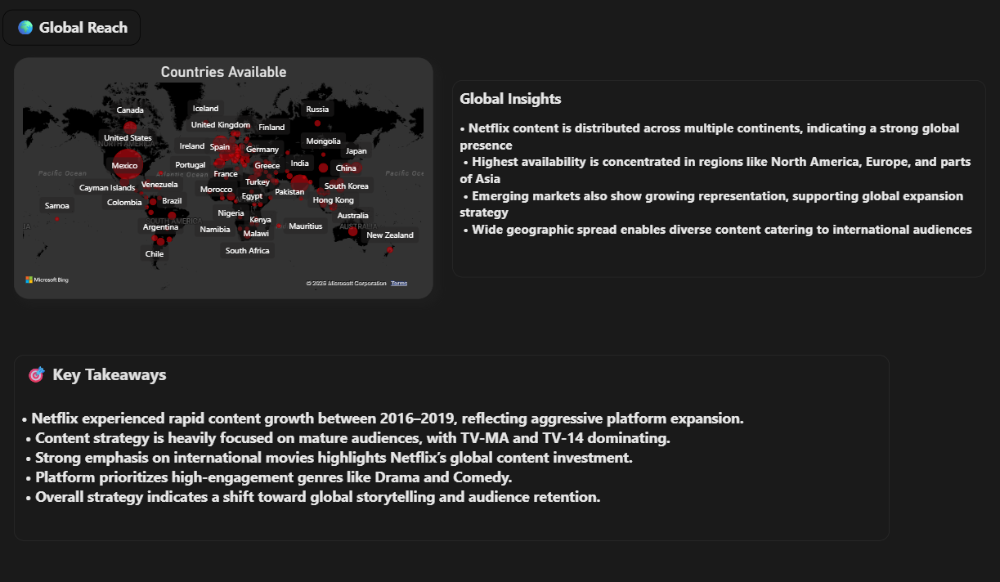

# 🎬 Netflix Content Strategy Dashboard

Analyzes 8,000+ titles from Netflix to uncover content trends, audience preferences, and global distribution strategy.
Built using Power BI, with SQL for data transformation and Excel for preprocessing, delivering actionable insights into genre popularity, maturity ratings, and international expansion.

 

## 🛠️ Tools Used

* Power BI
* SQL
* Excel

 

## 📌 Problem Statement

Netflix hosts a vast and diverse content library across multiple genres, countries, and audience segments.
The objective of this project is to analyze content trends and audience preferences to derive insights that support strategic content decisions and global expansion.

 

## 📊 Dataset

* Source: Netflix Titles Dataset
* Records: 8,000+ titles
* Key Fields: Title, Genre, Rating, Release Year, Country, Duration , Director , Cast , Listed in , Description
* Format: CSV files
* Preprocessing done using Excel and SQL

 

## ⚙️ Workflow

1. Data Source:

   * Received raw dataset in Excel (.csv format)

2. Data Cleaning (Excel):

   * Handled missing/null values
   * Structured data into organized worksheets

3. Data Transformation (SQL):

   * Converted denormalized data (multiple cast/country columns) into structured format
   * Used SQL UNION to combine columns into a single column
   * Removed duplicate entries to ensure clean dataset

4. Data Preparation:

   * Exported cleaned data into CSV format

5. Visualization (Power BI):

   * Imported datasets into Power BI
   * Built data model and relationships
   * Designed interactive dashboards

6. Insight Generation:

   * Analyzed trends , audience preferences and generated business insights.

 

## 📈 Key Metrics

* Total Titles
* Total Movies vs TV Shows
* Genre Distribution
* Ratings Distribution
* Yearly Content Additions
* Top 10 genres
* Country-wise Availability

 

## 🔑 Key Insights

* 📈 Content additions grew rapidly between **2016–2019**, peaking in 2019, indicating rapid platform expansion
* 🎬 Movies dominate the catalog, while TV Shows show steady growth
* 🔞 Majority of content is rated **TV-MA** and **TV-14**, highlighting focus on mature audiences
* 🌍 **International Movies** lead across genres, reflecting Netflix’s global content strategy
* 🎭 **Drama and Comedy** are the most prominent genres, indicating strong audience demand
* 🌐 Content is widely distributed across **North America, Europe, and Asia**, with emerging markets gaining traction
* 📉 A slight decline post-2020 suggests production slowdowns or strategic shifts

 

## 📊 Dashboard Overview

 

---

## 📈 Content Strategy Insights
 

 

## 🌍 Global Insights

 

## 🔎 Title Drilldown Analysis

 

## 💡 Recommendations

- Increase investment in **International Movies** to strengthen global reach and audience diversity  
- Prioritize **Drama and Comedy genres**, as they consistently show high engagement and demand  
- Focus on **TV Shows growth strategy**, as they demonstrate steady long-term expansion  
- Maintain consistent content releases to avoid post-2020 decline trends  
- Expand presence in **emerging markets (Asia & Europe)** to capture growing audiences

 

## 📁 Repository Contents

- 📊 **Power BI Dashboard (.pbix)** – Interactive dashboard with all visualizations  
- 📂 **Dataset Files (.csv)** – Cleaned and processed datasets used for analysis  
- 🧮 **SQL Queries** – Scripts used for data transformation and normalization  
- 🖼️ **Dashboard Images** – Exported visuals for quick preview  
- 📄 **README.md** – Complete project documentation
 

